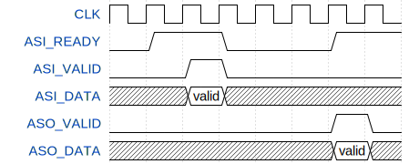

# FIB

Fibonacci function sample. This module is received index n, returns Fibonacci number corresponding to n. 

$F_n = F_{n-1} + F_{n-2}$

Interface is Avalon-ST.

## Interface

| Name      | Width | I/O  | P/N  | Description                             |
| --------- | ----- | ---- | ---- | --------------------------------------- |
| RESET_n   | 1     | I    | N    | Reset                                   |
| CLK       | 1     | I    | P    | Clock                                   |
| ASI_READY | 1     | O    | P    | Avalon-ST sink data ready               |
| ASI_VALID | 1     | I    | P    | Avalon-ST sink data valid               |
| ASI_DATA  | 31:0  | I    | P    | Avalon-ST sink data: index n            |
| ASO_VALID | 1     | O    | P    | Avalon-ST source data valid             |
| ASO_DATA  | 31:0  | O    | P    | Avalon-ST source data: Fibonacci number |
| ASO_ERROR | 1     | O    | P    | Avalon-ST source error                  |

Data width is parameterized with DW.



<!-- 
{signal:[
{name:'CLK',wave:'p.......'},
{name:'ASI_READY',wave:'01.0..1.'},
{name:'ASI_VALID',wave:'0.10....'},
{name:'ASI_DATA',wave:'x.=x....',data:["valid"]},
{name:'ASO_VALID',wave:'0.....10'},
{name:'ASO_DATA',wave:'x.....=x',data:["valid"]},
]
}
 -->

The description of Avalon-ST is introduced in references[[1](#intel_ast)].

`ASI_DATA` is index n, up to `0d47`. It is limited by the maximum value that can be represented by the data width of `ASO_DATA`. 

`ASO_ERROR` is asserted by the following conditions:

- Index n is out of range
- Calculation is overflow

## Project operation

### Build Quartus project

Make project and add VHDL source file.

```bash
$quartus_sh.exe --tcl_eval project_new FIB
$echo "set_global_assignment -name VHDL_FILE pld/FIB.vhd" >> FIB.qsf
```

Compile project

```bash
$make
quartus_sh.exe --flow compile FIB
```

### Run ModelSim simulation

```bash
$make check
```

If you rewrite the following statement in Makefile, GUI simulation runs.

**Makefile**(l.40)

```diff
-- 	vsim.exe -c -msgmode both -displaymsgmode both TB_$(PROJECT) $(MODELSIM_DO_FLAGS)
++ 	vsim.exe -msgmode both -displaymsgmode both TB_$(PROJECT) $(MODELSIM_DO_FLAGS)
```

## Operating environment

- Quartus Prime 18.0.0 Build 614 04/24/2018 SJ Lite Edition
- ModelSim - Intel FPGA Starter Edition 10.5b 2016.10
- Altera Nios2 Command Shell 18.0 Build 614 or
  Windows Subsystem for Linux(WSL) Ubuntu 16.04.6 LTS

## Reference

[1]<a name="intel_ast"></a> [5. Avalon Streaming Interfaces - Avalon Interface Specifications](https://www.intel.com/content/www/us/en/programmable/documentation/nik1412467993397.html#nik1412467963376)

## License

MIT License

## Author

[toms74209200](<https://github.com/toms74209200>)
